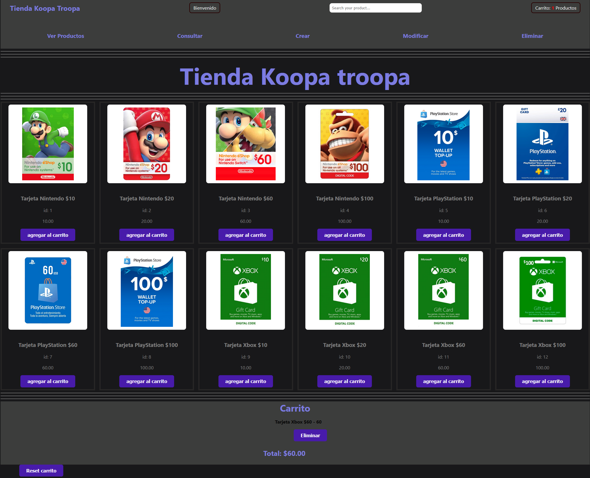

<div align="center">
    
    <h1>INTEGRADOR PROGRAMACION III - DIV 131 - UTN FRA</h1>
</div>

---
# Integrantes:
- Jonatan Quiroga
- Arturo Benicio Perotto

# Descripcion del Proyecto:
Consume la API REST hecha en el backend, simulando asi un totem autoservicio de giftcards online.

# Tecnologías Utilizadas

- **HTML5**: estructura del sitio  
- **CSS3**: estilos y diseño visual  
- **JavaScript (Vanilla JS)**: lógica del frontend y consumo de la API  
- **Node.js**: entorno de ejecución del backend  
- **Express.js**: framework para la creación de la API REST  
- **API REST**: comunicación entre frontend y backend


# Instalación:
```bash
git clone https://github.com/jon2236/grupo9Progra3ntegrador25Cuatri2_back.git
```


## Instalar dependencias
npm install


## Configuración del entorno
El proyecto requiere un archivo `.env` para funcionar correctamente.
1. Crear un archivo `.env` en la raíz del proyecto basándose en `.env.example`.
2. Definir un valor para la variable `SESSION_SECRET`.  
Ejemplo:

```env
PORT=3500
DB_HOST=localhost
DB_NAME=giftcards_db
DB_USER=root
DB_PASSWORD=
SESSION_SECRET=mi_clave_secreta


Asegurate de tener el servidor levantado (`npm run dev`) y abrir en el navegador este proyecto